# Wound Compute Repository

[](https://www.python.org/)

[](https://github.com/sandialabs/sibl#license)

[](https://github.com/elejeune11/woundcompute/actions) [](https://codecov.io/gh/elejeune11/woundcompute)


## Table of Contents
* [Project Summary](#summary)
* [Project Roadmap](#roadmap)
* [Installation Instructions](#install)
* [Tutorial](#tutorial)
* [Validation](#validation)
* [To-Do List](#todo)
* [References to Related Work](#references)
* [Contact Information](#contact)
* [Acknowledgements](#acknowledge)

## Project Summary <a name="summary"></a>

The Wound Compute software is a multi-purpose tool, designed to obtain and analyze information from our microtissue wound experiments (see: [references](#references)). Briefly, our experimental collaborators in the Jeroen Eyckman's lab seed and grow 3T3 cells into stromal microtissues, then the microtissues were injured using either a microdissection knife or a nanosecond-pulsed laser. The goal of our software is to automatically extract quantitative information from a high volume of these experimental images and movies. For example, given a stack of images for an injured microtissue in the process of healing, we can identify the wound region and measure critical properties such as wound area, major axis length, and minor axis length with respect to time. We can also track the motion and obtain the deflections of the microposts. Finally, we have also implemented some analysis to determine if the tissue is broken (i.e., detached from posts), or if the wound is closed. In this repository, we provide some details about Wound Compute, and the tutorials to run our software via a Command-Line Interface. If you're interested in in our Graphical User Interface, please check out this repository (link).

<p align = "center">
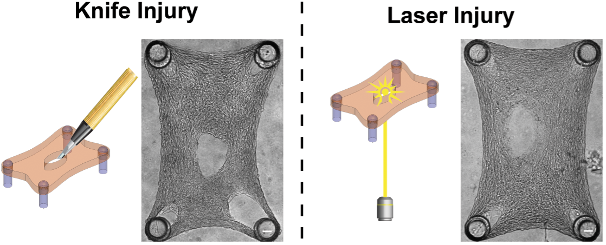

</p>

## Project Roadmap <a name="roadmap"></a>

Due to the large amount of data available from our experimental setup, it would take a lot of time for human annotators to manually label all the critical information from images. Here, we develop a comprehensive software for data curation and analysis of stromal microtissue wound healing. We have tested our software on 192 samples undergoing laser ablation injuries, which allows us to more thoroughly test for edge cases and make our software more robust. The roadmap for our project is as follow:

`Preliminary Dataset + Software` $\mapsto$ `Larger Dataset + Software Testing and Validation` $\mapsto$ `Published Software Package` $\mapsto$ `Published Validation Examples and Tutorial` $\mapsto$ `Automated Analysis of High-Throughput Experiments`

At present (November 2024), we have validated our software on our experimental dataset (link). In the next stage, we are interested in expanding our software to track the motion of the microtissue and the tissue assembly process. 

## Installation Instructions <a name="install"></a>

### Get a copy of the Wound Compute repository on your local machine

The best way to do this is to create a GitHub account and ``clone`` the repository. However, you can also download the repository by clicking the green ``Code`` button and selecting ``Download ZIP``. Downloaded and unzip the ``woundcompute-main`` folder and place it in a convenient location on your computer.

### Create and activate a conda virtual environment

1. Install [Anaconda](https://docs.anaconda.com/anaconda/install/) on your local machine.
2. Open a ``Terminal`` session (or equivalent) -- note that Mac computers come with ``Terminal`` pre-installed (type ``⌘-space`` and then search for ``Terminal``).
3. Type in the terminal to create a virtual environment with conda:
```bash
conda create --name wound-compute-env python=3.9.13
```
4. Type in the terminal to activate your virtual environment:
```bash
conda activate wound-compute-env
```
5. Check to make sure that the correct version of python is running (should be ``3.9.13``)
```bash
python --version
```
6. Update some base modules (just in case)
```bash
python -m pip install --upgrade pip setuptools wheel
```

Note that once you have created this virtual environment you can ``activate`` and ``deactivate`` it in the future -- it is not necessary to create a new virtual environment each time you want to run this code, you can simply type ``conda activate wound-compute-env`` and then pick up where you left off (see also: [conda cheat sheet](https://docs.conda.io/projects/conda/en/4.6.0/_downloads/52a95608c49671267e40c689e0bc00ca/conda-cheatsheet.pdf)).

### Install wound compute

1. Use a ``Terminal`` session to navigate to the ``woundcompute-main`` folder. The command ``cd`` will allow you to do this (see: [terminal cheat sheet](https://terminalcheatsheet.com/))
2. Type the command ``ls`` and make sure that the file ``pyproject.toml`` is in the current directory.
3. Now, create an editable install of wound compute:
```bash
python -m pip install -e .
```
4. If you would like to see what packages this has installed, you can type ``pip list``
5. You can test that the code is working with pytest (all tests should pass):
```bash
pytest -v --cov=woundcompute  --cov-report term-missing
```
6. To run the code from the terminal, simply start python (type ``python``) and then type ``from woundcompute import image_analysis as ia``. For example:
```bash
(wound-compute-env) eml-macbook-pro:woundcompute-main emma$ python
Python 3.9.13 | packaged by conda-forge | (main, May 27 2022, 17:01:00) 
[Clang 13.0.1 ] on darwin
Type "help", "copyright", "credits" or "license" for more information.
>>> from woundcompute import image_analysis as ia
>>> ia.hello_wound_compute()
>>> "Hello World!
```

## Tutorial <a name="tutorial"></a>

This GitHub repository contains a folder called ``tutorials`` that contains an example dataset and python script for running the code.

### Preparing data for analysis <a name="data_prep"></a>
To follow along with our tutorials, the example folders (i.e., `s1`, `s2`, `s3`) can be found in the following path:
```bash
|___ tutorials
|       |___ files
|               |___ sample_dataset
|                       |___ s18_B08
|                       |___ s21_B05
|                       |___ s22_B04
```
For each example, the input dataset for analysis will have this folder structure:
```bash
|___ Example_folder
|        |___ input_file.yaml
|        |___ brightfield_images
|                |___"*.TIF"
|        |___ fluorescent_images
|                |___"*.TIF"
|        |___ ph1_images
|                |___"*.TIF"
```
The data will be contained in the ``brightfield_image``, ``fluorescent_images``, and ``ph1_images`` folders. Critically:
1. The files must have a ``.TIF`` extension.
2. The files can have any name, but in order for the code to work properly they must be *in order*. For reference, we use ``sort`` to order file names:
```bash
(wound-compute-env) eml-macbook-pro:tutorials emma$ python
Python 3.9.13 | packaged by conda-forge | (main, May 27 2022, 17:01:00) 
[Clang 13.0.1 ] on darwin
Type "help", "copyright", "credits" or "license" for more information.
>>> bad_example = ["1","2","3","4","5","6","7","8","9","10","11","12","13","14","15"]
>>> bad_example.sort()
>>> print(bad_example)
['1', '10', '11', '12', '13', '14', '15', '2', '3', '4', '5', '6', '7', '8', '9']
>>>
>>> good_example = ["01","02","03","04","05","06","07","08","09","10","11","12","13","14","15"]
>>> good_example.sort()
>>> print(good_example)
['01', '02', '03', '04', '05', '06', '07', '08', '09', '10', '11', '12', '13', '14', '15']
>>> another_good_example = ["test_001","test_002","test_003","test_004","test_005","test_006","test_007","test_008","test_009","test_010","test_011","test_012","test_013","test_014","test_015"]
>>> another_good_example.sort()
>>> print(another_good_example)
['test_001', 'test_002', 'test_003', 'test_004', 'test_005', 'test_006', 'test_007', 'test_008', 'test_009', 'test_010', 'test_011', 'test_012', 'test_013', 'test_014', 'test_015']
```
3. It is OK for the example to only contain one image type and corresponding folder (e.g., if only brightfield images were recorded, the example will be missing the ``fluorescent_images`` folder and the ``ph1_images`` folder). This information will be reflected in the [input file](#input).
4. In order to run automatic comparison between the brightfield and fluorescent examples, they must contain the same number of frames.
5. If it is necessary to read other file types or formats (e.g., a single 3D TIFF array), that would be easy to implement -- we can add it to the to-do list. In addition, we can add a python function to rename files so that they are in order according to ```np.sort``` if that is necessary.

### Preparing an input file<a name="input"></a>

The input file must be stored in the same folder as the data (see [schematic](#data_prep)). The input is a ``.yaml`` or ``.yml`` file that can be created, opened, and edited in any simple text editor (e.g., [TextEdit](https://support.apple.com/guide/textedit/welcome/mac), [BBEdit](https://www.barebones.com/products/bbedit/), [Sublime Text](https://www.sublimetext.com/)). Here is an example input file ``test_movie.yaml``:
```bash
# User input for running the test_movie example
version: 1.0 # do not modify
segment_brightfield: false
seg_bf_version: 1 # do not modify
seg_bf_visualize: false
segment_fluorescent: false
seg_fl_version: 1 # do not modify
seg_fl_visualize: false
segment_ph1: true
seg_ph1_version: 2
seg_ph1_visualize: true
track_brightfield: false # do not modify
track_bf_version: 1 # do not modify
track_bf_visualize: false # do not modify
track_ph1: false # do not modify
track_ph1_version: 1 # do not modify
track_ph1_visualize: false # do not modify
bf_seg_with_fl_seg_visualize: false
bf_track_with_fl_seg_visualize: false # do not modify
ph1_seg_with_fl_seg_visualize: false # do not modify
ph1_track_with_fl_seg_visualize: false # do not modify
zoom_type: 2 # set to 1 for examples where you cannot see the pillars, set to 2 for examples where the pillars are visible
track_pillars_ph1: true # this should be False for zoom type 1, set to True if you want pillar tracking for zoom type 2
```
Many of the inputs (noted ``# do not modify``) will only be relevant to future functionality. For running your own examples, the ``.yaml`` file should look identical to this example. However, you can change ``True`` to ``False`` for any step that you want to skip. For example, if your example does not have fluorescent images you should set ``segment_fluorescent``, ``seg_fl_visualize``, and ``bf_seg_with_fl_seg_visualize`` to ``False``. The ``.yaml`` file example shown above corresponds to the tutorial examples ``s18_B08``.

### Running the code

Once all of the previous steps are completed, running the code is actually quite straightforward. To run the tutorial examples, navigate terminal so that your current directory is in the ``tutorials`` folder. To run the code on the provided single example, type:
```bash
python run_code_tutorial.py files/sample_dataset/s18_B08
```
And it will automatically run the example specified by the ``files/test_movie`` folder. You can use the ``run_code_tutorial.py`` to run your own code, you just need to specify a relative path between your current working directory (i.e., the directory that your ``Terminal`` is in) and the data that you want to analyze.

We have also provided a tutorial example that shows one way to run a whole dataset. To run the code on all of the files specified in the ``files/sample_dataset`` folder, simply navigate to the ``tutorials`` folder and type:
```bash
python run_code_on_dataset_tutorial.py
```
And it will automatically run examples ``s18_B08``, ``s21_B05``, and ``s22_B04`` contained in the ``sample_dataset`` folder. This script can be readily adapted to run through an alternative dataset. However, please note that the input data must be prepared following the prior instructions and ``yaml`` files must be included. In preparing the dataset in this format, the following python commands may be helpful: ``list.startswith(".")``, ``list.find(".db")``, ``list.find(".nd")``, ``folder1.joinpath(folder2).resolve()``, ``glob.glob(string + "/.TIF")``, ``string.split(".")``, ``string.split("_")``, ``string.split("/")``, ``np.unique(name_list)``, ``shutil.move(file, file_new)``, ``os.rename(file, file_new)``, and ``os.system(string)`` where ``string`` may contiain linux commands such as ``mv`` or ``cp`` etc.. These commands come from the packages: ``glob``, ``os``, ``numpy``, ``pathlib``, and ``shutil``.

### Understanding the output files

For the tutorial example, outputs are grouped according to the options in the ``.yaml`` file. Note that ``*`` refers to the [wildcard character](https://en.wikipedia.org/wiki/Wildcard_character) and corresponds to frame number.

**_Outputs from ph1 segmentation_** (``seg_ph1_visualize: true``):
* ``files/sample_dataset/s*/segment_ph1/contour_coords_*.npy``
* ``files/sample_dataset/s*/segment_ph1/is_broken_vs_frame.txt.txt``
* ``files/sample_dataset/s*/segment_ph1/is_closed_vs_frame.txt``
* ``files/sample_dataset/s*/segment_ph1/tissue_mask_*.npy``
* ``files/sample_dataset/s*/segment_ph1/tissue_parameters_vs_frame.txt``
* ``files/sample_dataset/s*/segment_ph1/wound_area_vs_frame.txt``
* ``files/sample_dataset/s*/segment_ph1/wound_mask_*.npy``
* ``files/sample_dataset/s*/segment_ph1/wound_major_axis_length_vs_frame.txt``
* ``files/sample_dataset/s*/segment_ph1/wound_minor_axis_length_vs_frame.txt``
 
 The files ``contour_coords_*.npy`` contain the coordinates of the points outlining the wound, while the files ``wound_mask_*.npy`` contain binary images depicting the wound. The files ``tissue_mask_*.npy`` are the binary images of the microtissue. Here, we show the images for the first frame, and the corresponding tissue mask and wound mask:

<p align = "center">
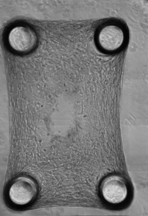
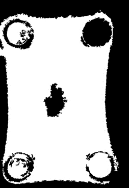
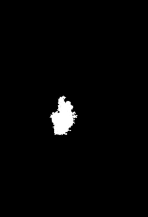
</p>

The files ``is_broken_vs_frame.txt`` and ``is_closed_vs_frame.txt`` report ``0`` for ``False`` and ``1`` for ``True`` with one entry per frame. For example, if the tissue never breaks and never closes, both files will just contain a 1D array of zeros.

The file ``tissue_parameters_vs_frame.txt`` has one row per frame, where the column entries (in order) are:
* ``area``: area of the tissue mask
* ``pt1_0``: ``0`` coordinate of the first point (``pt1``) that defines tissue width
* ``pt1_1``: ``1`` coordinate of the first point that defines tissue width
* ``pt2_0``: ``0`` coordinate of the second point (``pt2``) that defines tissue width
* ``pt2_1``: ``1`` coordinate of the second point that defines tissue width
* ``width``: width of the tissue mask (distance between ``pt1`` and ``pt2``)
* ``kappa_1``: tissue curvature at ``pt1``
* ``kappa_2``: tissue curvature at ``pt2``

The file ``wound_area_vs_frame.txt`` has the computed area for the wound over time. Below we displayed the graphs for some quantities of interest over time:

<p align = "center">
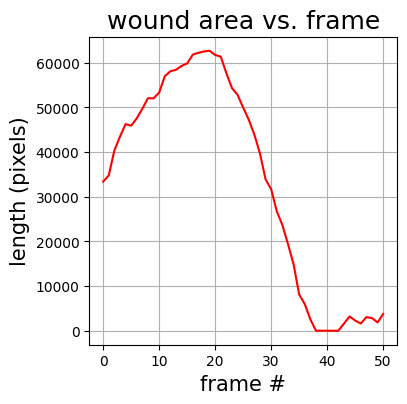
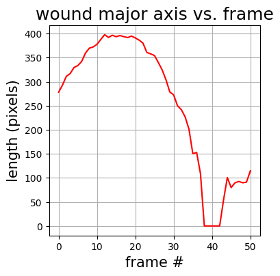
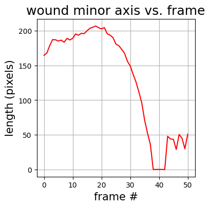
</p>

**_Output from pillars tracking_** (``track_pillars_ph1: true``):
* ``files/sample_dataset/s*/track_pillars_ph1/pillar_tracker_x.txt``
* ``files/sample_dataset/s*/track_pillars_ph1/pillar_tracker_y.txt``

The files ``pillar_tracker_x.txt`` and ``pillar_tracker_y.txt`` contain the x and y positions of the 4 pillars, where the first column corresponds to the first pillar, second column to second pillar, and so on.

**_Output from ph1 segmentation visualization_** (``seg_ph1_visualize: true``):
* ``files/sample_dataset/s*/segment_ph1/visualization/ph1_contour_*.png``
* ``files/sample_dataset/s*/segment_ph1/visualization/ph1_contour.gif``

The file ``ph1_contour.gif`` (shown below) contains all images from ``ph1_contour_*.png`` showing the wound margin and pillars tracking over time. The ``.gif`` also includes visualizations notifying when the microtissue is broken, or when the wound is closed.

<p align = "center">

</p>

## Validation <a name="validation"></a>
To validate our Wound Compute software, we compare the manually labeled results against the Wound Compute results. The results we're interested in are the broken status of the tissue, the wound closure status, the numbers of pillars successfully tracked, and the area of the wound segmented. For the wound closure status, the mismatched values between manual labeling and Wound Compute labeling could be caused by mislabeling of the wound closure status (i.e., label a closed wound as opened), or a mislabeling of the wound closure frame (i.e., label the wound closure frame as 26 when the wound closes on frame 28). Finally, we note that even if the areas of the manual label and the Wound Compare label match, the wound segmentation might be slightly inaccurate due to the ambiguity that comes with delineating the wound margin. We recommend checking the automated wound segmentation result manually.

<p align = "center">

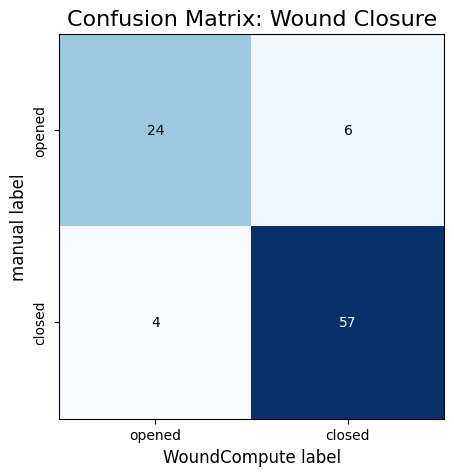
<!--  -->
</p>

<p align = "center">
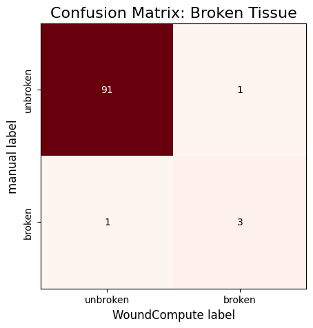
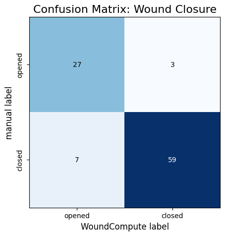
<!--  -->
</p>

<p align = "center">
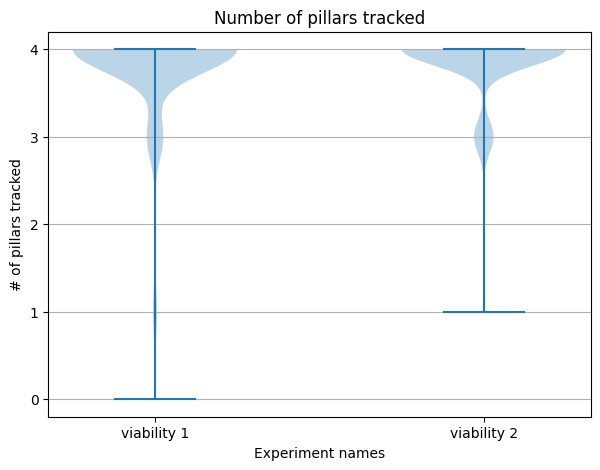
</p>

## References to Related Work <a name="references"></a>
* Das, S. L., Bose, P., Lejeune, E., Reich, D. H., Chen, C., & Eyckmans, J. (2021). Extracellular matrix alignment directs provisional matrix assembly and three dimensional fibrous tissue closure. Tissue Engineering Part A, 27(23-24), 1447-1457. https://doi.org/10.1089/ten.tea.2020.0332
* Mailand, E., Li, B., Eyckmans, J., Bouklas, N., & Sakar, M. S. (2019). Surface and bulk stresses drive morphological changes in fibrous microtissues. Biophysical journal, 117(5), 975-986. https://doi.org/10.1016/j.bpj.2019.07.041
* Sakar, M. S., Eyckmans, J., Pieters, R., Eberli, D., Nelson, B. J., & Chen, C. S. (2016). Cellular forces and matrix assembly coordinate fibrous tissue repair. Nature communications, 7(1), 1-8. https://doi.org/10.1038/ncomms11036 -- source of schematic diagram in the [Project Summary](#summary).
* Tefft, J. B., Chen, C. S., & Eyckmans, J. (2021). Reconstituting the dynamics of endothelial cells and fibroblasts in wound closure. APL bioengineering, 5(1), 016102. https://doi.org/10.1063/5.0028651


## Contact Information <a name="contact"></a>

At present, this repository is public to facilitate collaboration between the Lejeune + Eyckmans research groups. However, we welcome feedback and interest from others.

For information about this software, please get in touch with [Emma Lejeune](https://www.bu.edu/eng/profile/emma-lejeune/). For information about this experimental system, please get in touch with [Jeroen Eyckmans](https://www.bu.edu/eng/profile/jeroen-eyckmans-phd/).

## Acknowledgements <a name="acknowledge"></a>

Big thank you to Chad Hovey for providing templates for I/O, testing, and installation via the [Sandia Injury Biomechanics Laboratory](https://github.com/sandialabs/sibl) repository.