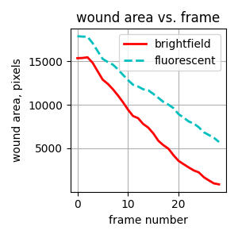
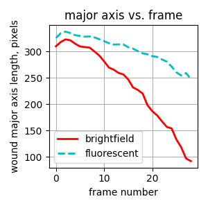
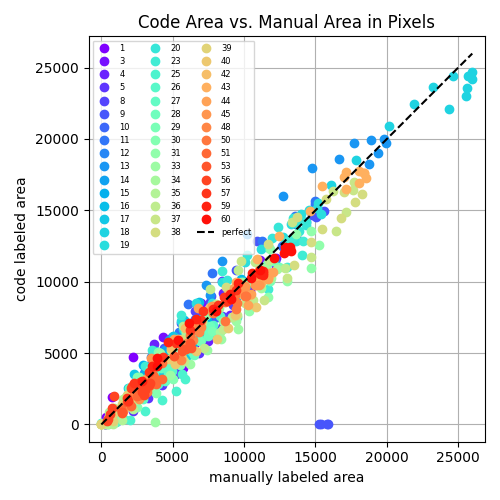

# Wound Compute Repository

[](https://www.python.org/)

[](https://github.com/sandialabs/sibl#license)

[](https://github.com/elejeune11/woundcompute/actions) [](https://codecov.io/gh/elejeune11/woundcompute)


## Table of Contents
* [Project Summary](#summary)
* [Project Roadmap](#roadmap)
* [Installation Instructions](#install)
* [Tutorial](#tutorial)
* [Validation](#validation)
* [To-Do List](#todo)
* [References to Related Work](#references)
* [Contact Information](#contact)
* [Acknowledgements](#acknowledge)

## Project Summary <a name="summary"></a>

This software is designed to analyze experimental data from micro-tissue wound experiments (see: [references](#references)). The goal of our software is to extract quantitative information from these images and movies. For example, we can automatically identify the wound region which allows us extract properties such as wound area, major axis length, and minor axis length with respect to time. We can also automatically identify tissue properties such as tissue width, and tissue edge curvature, determine if the tissue is broken (i.e., detached from posts) or if the wound is closed.

<p align = "center">


</p>

We are also adding additional funcitonality for tracking tissue deformation between frames -- these functions are included in the repository and testing is currently underway -- stay tuned!

## Project Roadmap <a name="roadmap"></a>

We plan to develop and disseminate an "all-purpose" software for data curation and analysis from micro-tissue wound experiments. The roadmap for this collaborative endeavor is as follows:

`Preliminary Dataset + Software` $\mapsto$ `Larger Dataset + Software Testing and Validation` $\mapsto$ `Published Software Package` $\mapsto$ `Published Validation Examples and Tutorial` $\mapsto$ `Automated Analysis of High-Throughput Experiments`

At present (**October 2022**) we are in the process of testing and validating our software on larger datasets. Specifically, we are (1) identifying scenarios where our approach fails and creating functions to accomodate them, and (2) comparing software results to previous manual approaches for extracting quantitative information. We will continue to update this repository as the project progresses.

## Installation Instructions <a name="install"></a>

### Get a copy of the wound compute repository on your local machine

The best way to do this is to create a GitHub account and ``clone`` the repository. However, you can also download the repository by clicking the green ``Code`` button and selecting ``Download ZIP``. Downloaded and unzip the ``woundcompute-main`` folder and place it in a convenient location on your computer.

### Create and activate a conda virtual environment

1. Install [Anaconda](https://docs.anaconda.com/anaconda/install/) on your local machine.
2. Open a ``Terminal`` session (or equivalent) -- note that Mac computers come with ``Terminal`` pre-installed (type ``⌘-space`` and then search for ``Terminal``).
3. Type in the terminal to create a virtual environment with conda:
```bash
conda create --name wound-compute-env python=3.9.13
```
4. Type in the terminal to activate your virtual environment:
```bash
conda activate wound-compute-env
```
5. Check to make sure that the correct version of python is running (should be ``3.9.13``)
```bash
python --version
```
6. Update some base modules (just in case)
```bash
pip install --upgrade pip setuptools wheel
```

Note that once you have created this virtual environment you can ``activate`` and ``deactivate`` it in the future -- it is not necessary to create a new virtual environment each time you want to run this code, you can simply type ``conda activate wound-compute-env`` and then pick up where you left off (see also: [conda cheat sheet](https://docs.conda.io/projects/conda/en/4.6.0/_downloads/52a95608c49671267e40c689e0bc00ca/conda-cheatsheet.pdf)).

### Install wound compute

1. Use a ``Terminal`` session to navigate to the ``woundcompute-main`` folder. The command ``cd`` will allow you to do this (see: [terminal cheat sheet](https://terminalcheatsheet.com/))
2. Type the command ``ls`` and make sure that the file ``pyproject.toml`` is in the current directory.
3. Now, create an editable install of wound compute:
```bash
pip install -e .
```
4. If you would like to see what packages this has installed, you can type ``pip list``
5. You can test that the code is working with pytest (all tests should pass):
```bash
pytest -v --cov=woundcompute  --cov-report term-missing
```
6. To run the code from the terminal, simply start python (type ``python``) and then type ``from woundcompute import image_analysis as ia``. For example:
```bash
(wound-compute-env) eml-macbook-pro:woundcompute-main emma$ python
Python 3.9.13 | packaged by conda-forge | (main, May 27 2022, 17:01:00) 
[Clang 13.0.1 ] on darwin
Type "help", "copyright", "credits" or "license" for more information.
>>> from woundcompute import image_analysis as ia
>>> ia.hello_wound_compute()
>>> "Hello World!
```

## Tutorial <a name="tutorial"></a>

This GitHub repository contains a folder called ``tutorials`` that contains an example dataset and python script for running the code.

### Preparing data for analysis <a name="data_prep"></a>
The input dataset for analysis will have this folder structure:
```bash
|___ Example_folder
|        |___ input_file.yaml
|        |___ brightfield_images
|                |___"*.TIF"
|        |___ fluorescent_images
|                |___"*.TIF"
|        |___ ph1_images
|                |___"*.TIF"
```
The data will be contained in the ``brightfield_image``, ``fluorescent_images``, and ``ph1_images`` folders. Critically:
1. The files must have a ``.TIF`` extension.
2. The files can have any name, but in order for the code to work properly they must be *in order*. For reference, we use ``sort`` to order file names:
```bash
(wound-compute-env) eml-macbook-pro:tutorials emma$ python
Python 3.9.13 | packaged by conda-forge | (main, May 27 2022, 17:01:00) 
[Clang 13.0.1 ] on darwin
Type "help", "copyright", "credits" or "license" for more information.
>>> bad_example = ["1","2","3","4","5","6","7","8","9","10","11","12","13","14","15"]
>>> bad_example.sort()
>>> print(bad_example)
['1', '10', '11', '12', '13', '14', '15', '2', '3', '4', '5', '6', '7', '8', '9']
>>>
>>> good_example = ["01","02","03","04","05","06","07","08","09","10","11","12","13","14","15"]
>>> good_example.sort()
>>> print(good_example)
['01', '02', '03', '04', '05', '06', '07', '08', '09', '10', '11', '12', '13', '14', '15']
>>> another_good_example = ["test_001","test_002","test_003","test_004","test_005","test_006","test_007","test_008","test_009","test_010","test_011","test_012","test_013","test_014","test_015"]
>>> another_good_example.sort()
>>> print(another_good_example)
['test_001', 'test_002', 'test_003', 'test_004', 'test_005', 'test_006', 'test_007', 'test_008', 'test_009', 'test_010', 'test_011', 'test_012', 'test_013', 'test_014', 'test_015']
```
3. It is OK for the example to only contain one image type and corresponding folder (e.g., if only brightfield images were recorded, the example will be missing the ``fluorescent_images`` folder and the ``ph1_images`` folder). This information will be reflected in the [input file](#input).
4. In order to run automatic comparison between the brightfield and fluorescent examples, they must contain the same number of frames.
5. If it is necessary to read other file types or formats (e.g., a single 3D TIFF array), that would be easy to implement -- we can add it to the to-do list. In addition, we can add a python function to rename files so that they are in order according to ```np.sort``` if that is necessary.

### Preparing an input file<a name="input"></a>

The input file must be stored in the same folder as the data (see [schematic](#data_prep)). The input is a ``.yaml`` or ``.yml`` file that can be created, opened, and edited in any simple text editor (e.g., [TextEdit](https://support.apple.com/guide/textedit/welcome/mac), [BBEdit](https://www.barebones.com/products/bbedit/), [Sublime Text](https://www.sublimetext.com/)). Here is an example input file ``test_movie.yaml``:
```bash
# User input for running the test_movie example
version: 1.0 # do not modify
segment_brightfield: True
seg_bf_version: 1 # do not modify
seg_bf_visualize: True
segment_fluorescent: True
seg_fl_version: 1 # do not modify
seg_fl_visualize: True
segment_ph1: False
seg_ph1_version: 1
seg_ph1_visualize: False
track_brightfield: False # do not modify
track_bf_version: 1 # do not modify
track_bf_visualize: False # do not modify
track_ph1: False # do not modify
track_ph1_version: 1 # do not modify
track_ph1_visualize: False # do not modify
bf_seg_with_fl_seg_visualize: True
bf_track_with_fl_seg_visualize: False # do not modify
ph1_seg_with_fl_seg_visualize: False # do not modify
ph1_track_with_fl_seg_visualize: False # do not modify
```
Many of the inputs (noted ``# do not modify``) will only be relevant to future functionality. For running your own examples, the ``.yaml`` file should look identical to this example. However, you can change ``True`` to ``False`` for any step that you want to skip. For example, if your example does not have fluorescent images you should set ``segment_fluorescent``, ``seg_fl_visualize``, and ``bf_seg_with_fl_seg_visualize`` to ``False``. The ``.yaml`` file example shown above corresponds to the tutorial examples ``test_movie``.

### Running the code

Once all of the previous steps are completed, running the code is actually quite straightforward. To run the tutorial examples, navigate terminal so that your current directory is in the ``tutorials`` folder. To run the code on the provided single example, type:
```bash
python run_code_tutorial.py files/test_movie
```
And it will automatically run the example specified by the ``files/test_movie`` folder. You can use the ``run_code_tutorial.py`` to run your own code, you just need to specify a relative path between your current working directory (i.e., the directory that your ``Terminal`` is in) and the data that you want to analyze.

We have also provided a tutorial example that shows one way to run a whole dataset. To run the code on all of the files specified in the ``files/sample_dataset`` folder, simply navigate to the ``tutorials`` folder and type:
```bash
python run_code_on_dataset_tutorial.py
```
And it will automatically run examples ``s1``, ``s2``, and ``s3`` contained in the ``sample_dataset`` folder. This script can be readily adapted to run through an alternative dataset. However, please note that the input data must be prepared following the prior instructions and ``yaml`` files must be included. In preparing the dataset in this format, the following python commands may be helpful: ``list.startswith(".")``, ``list.find(".db")``, ``list.find(".nd")``, ``folder1.joinpath(folder2).resolve()``, ``glob.glob(string + "/.TIF")``, ``string.split(".")``, ``string.split("_")``, ``string.split("/")``, ``np.unique(name_list)``, ``shutil.move(file, file_new)``, ``os.rename(file, file_new)``, and ``os.system(string)`` where ``string`` may contiain linux commands such as ``mv`` or ``cp`` etc.. These commands come from the packages: ``glob``, ``os``, ``numpy``, ``pathlib``, and ``shutil``.

### Understanding the output files

For the tutorial example, outputs are summarized as follows. Note that ``*`` refers to the [wildcard character](https://en.wikipedia.org/wiki/Wildcard_character) and corresponds to frame number.

Outputs from brightfield segmentation (``test_movie`` example):
* ``files/test_movie/segment_brightfield/contour_coords_*.npy``
* ``files/test_movie/segment_brightfield/tissue_mask_*.npy``
* ``files/test_movie/segment_brightfield/wound_mask_*.npy``
* ``files/test_movie/segment_brightfield/wound_area_vs_frame.txt``
* ``files/test_movie/segment_brightfield/wound_major_axis_length_vs_frame.txt``
* ``files/test_movie/segment_brightfield/wound_minor_axis_length_vs_frame.txt``
* ``files/test_movie/segment_brightfield/is_broken_vs_frame.txt.txt``
* ``files/test_movie/segment_brightfield/is_closed_vs_frame.txt``
* ``files/test_movie/segment_brightfield/tissue_parameters_vs_frame.txt``

Outputs from fluorescent segmentation (``test_movie`` example):
* ``files/test_movie/segment_fluorescent/contour_coords_*.npy``
* ``files/test_movie/segment_fluorescent/tissue_mask_*.npy``
* ``files/test_movie/segment_fluorescent/wound_mask_*.npy``
* ``files/test_movie/segment_fluorescent/wound_area_vs_frame.txt``
* ``files/test_movie/segment_fluorescent/wound_major_axis_length_vs_frame.txt``
* ``files/test_movie/segment_fluorescent/wound_minor_axis_length_vs_frame.txt``
* ``files/test_movie/segment_fluorescent/is_broken_vs_frame.txt.txt``
* ``files/test_movie/segment_fluorescent/is_closed_vs_frame.txt``
* ``files/test_movie/segment_fluorescent/tissue_parameters_vs_frame.txt``

Outputs from ph1 segmentation (``sample_dataset`` example):
* ``files/sample_dataset/s*/segment_ph1/contour_coords_*.npy``
* ``files/sample_dataset/s*/segment_ph1/tissue_mask_*.npy``
* ``files/sample_dataset/s*/segment_ph1/wound_mask_*.npy``
* ``files/sample_dataset/s*/segment_ph1/wound_area_vs_frame.txt``
* ``files/sample_dataset/s*/segment_ph1/wound_major_axis_length_vs_frame.txt``
* ``files/sample_dataset/s*/segment_ph1/wound_minor_axis_length_vs_frame.txt``
* ``files/sample_dataset/s*/segment_ph1/is_broken_vs_frame.txt.txt``
* ``files/sample_dataset/s*/segment_ph1/is_closed_vs_frame.txt``
* ``files/sample_dataset/s*/segment_ph1/tissue_parameters_vs_frame.txt``

The files ``is_broken_vs_frame.txt`` and ``is_closed_vs_frame.txt`` report ``0`` for ``False`` and ``1`` for ``True`` with one entry per frame. For example, if the tissue never breaks and never closes, both files will just contain a 1D array of zeros.

The file ``tissue_parameters_vs_frame.txt`` has one row per frame, where the column entries (in order) are:
* ``area``: area of the tissue mask
* ``pt1_0``: ``0`` coordinate of the first point (``pt1``) that defines tissue width
* ``pt1_1``: ``1`` coordinate of the first point that defines tissue width
* ``pt2_0``: ``0`` coordinate of the second point (``pt2``) that defines tissue width
* ``pt2_1``: ``1`` coordinate of the second point that defines tissue width
* ``width``: width of the tissue mask (distance between ``pt1`` and ``pt2``)
* ``kappa_1``: tissue curvature at ``pt1``
* ``kappa_2``: tissue curvature at ``pt2``

Output from brightfield segmentation visualization (``test_movie``):
* ``files/test_movie/segment_brightfield/visualization/brightfield_contour_*.png``
* ``files/test_movie/segment_brightfield/visualization/brightfield_contour.gif``

Output from fluorescent segmentation visualization (``test_movie``):
* ``files/test_movie/segment_fluorescent/visualization/fluorescent_contour_*.png``
* ``files/test_movie/segment_fluorescent/visualization/fluorescent_contour.gif``

Output from brightfield segmentation with fluorescent segmentation visualization (``test_movie``):
* ``files/test_movie/bf_seg_with_fl_seg_visualize/bf_with_fl_*.png``
* ``files/test_movie/bf_seg_with_fl_seg_visualize/bf_with_fl.gif``

Output from ph1 segmentation visualization (``sample_dataset``):
* ``files/sample_dataset/s*/segment_ph1/visualization/ph1_contour_*.png``
* ``files/sample_dataset/s*/segment_ph1/visualization/ph1_contour.gif``

Notably, these outputs contain the tissue and wound mask for each segmented image:

<p align = "center">


</p>

<p align = "center">


</p>

And, they contain wound area, wound major axis length, and wound minor axis length with respect to frame number for the whole movie:

<p align = "center">



</p>

They also contain the wound contours, and wound contour visualizations (red solid line is the brightfield contour, blue dashed line is the fluorescent contour.)

<p align = "center">

</p>


Finally, updated visualizations also show wound contour visualization, tissue width visualization, and text annotations if the tissue is either ``broken`` or ``closed``.

<p align = "center">

</p>

<p align = "center">

</p>

## Validation <a name="validation"></a>
To date, we have compared code outputs vs. manual outputs for 246 samples across 5 experiments (2 different researchers performed these experiments). For all cases shown here, the code is run with identical parameters and generated no errors on these samples during runtime. Validation results are shown below.

<p align = "center">


</p>

<p align = "center">



</p>

<p align = "center">


</p>

<p align = "center">


</p>

<p align = "center">


</p>

Please note that in some cases, there may be errors in defining ground truth data, whereas in other cases the code may not perfectly capture experimental results (e.g., losing image focus). For more details on the experimental setup, please see our [References to Related Work](#references) section

## To-Do List <a name="todo"></a>
- [x] Add segmentation tools specific to Phase Contrast Microscopy
- [x] Include previous work on tissue deformation tracking in this repository
- [ ] Perform large scale validation and testing of tissue deformation tracking (functions and preliminary tests have been uploaded but not finalized)
- [x] Implement a check for broken tissue
- [x] Implement a check for closed tissue
- [x] Implement error catching to enable high-throughput runs of the code
- [x] Validate wound segmentation vs. hand labeled data (Megan data + Anish data considered thus far)
- [ ] Perform additional validation vs. hand labeled data
- [x] Add tissue width measurements to code outputs
- [ ] Compare our procedural wound segmentation to machine learning approaches to wound segmentation
- [ ] Add additional quantities of interest to the automatically computed outputs/ improve current functionality
- [ ] Work on input/output data formatting to better fit experimental needs
- [ ] ?

## References to Related Work <a name="references"></a>
* Das, S. L., Bose, P., Lejeune, E., Reich, D. H., Chen, C., & Eyckmans, J. (2021). Extracellular matrix alignment directs provisional matrix assembly and three dimensional fibrous tissue closure. Tissue Engineering Part A, 27(23-24), 1447-1457. https://doi.org/10.1089/ten.tea.2020.0332
* Mailand, E., Li, B., Eyckmans, J., Bouklas, N., & Sakar, M. S. (2019). Surface and bulk stresses drive morphological changes in fibrous microtissues. Biophysical journal, 117(5), 975-986. https://doi.org/10.1016/j.bpj.2019.07.041
* Sakar, M. S., Eyckmans, J., Pieters, R., Eberli, D., Nelson, B. J., & Chen, C. S. (2016). Cellular forces and matrix assembly coordinate fibrous tissue repair. Nature communications, 7(1), 1-8. https://doi.org/10.1038/ncomms11036 -- source of schematic diagram in the [Project Summary](#summary).
* Tefft, J. B., Chen, C. S., & Eyckmans, J. (2021). Reconstituting the dynamics of endothelial cells and fibroblasts in wound closure. APL bioengineering, 5(1), 016102. https://doi.org/10.1063/5.0028651


## Contact Information <a name="contact"></a>

At present, this repository is public to facilitate collaboration between the Lejeune + Eyckmans research groups. However, we welcome feedback and interest from others.

For information about this software, please get in touch with [Emma Lejeune](https://www.bu.edu/eng/profile/emma-lejeune/). For information about this experimental system, please get in touch with [Jeroen Eyckmans](https://www.bu.edu/eng/profile/jeroen-eyckmans-phd/).

## Acknowledgements <a name="acknowledge"></a>

Big thank you to Chad Hovey for providing templates for I/O, testing, and installation via the [Sandia Injury Biomechanics Laboratory](https://github.com/sandialabs/sibl) repository.